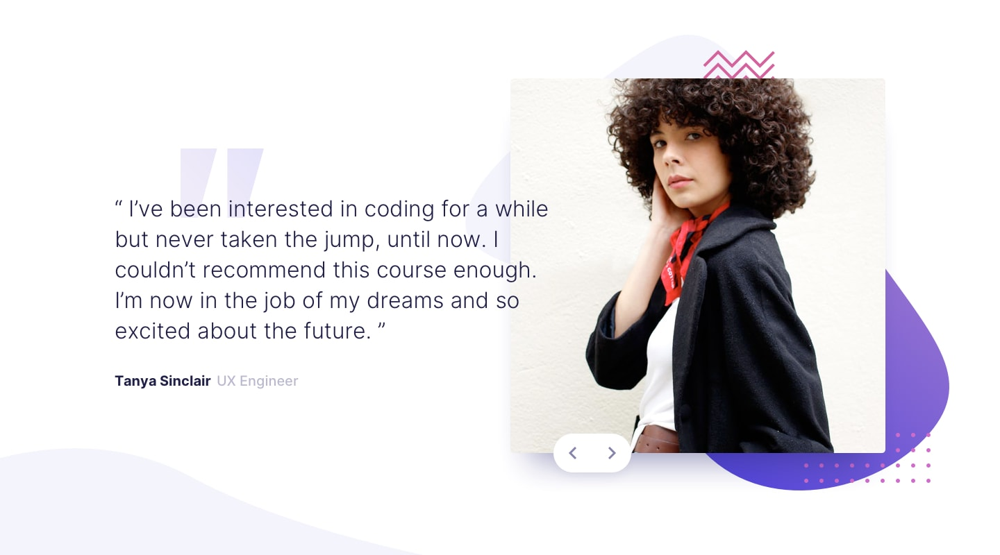
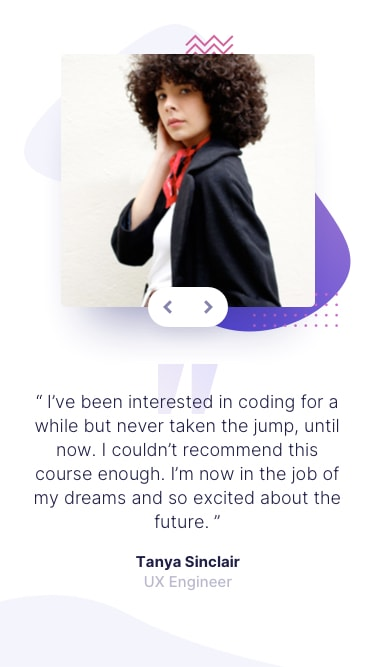

# 💬 Coding Bootcamp Testimonials Slider

Um carrossel de depoimentos totalmente responsivo, construído a partir de um desafio do Frontend Mentor — com navegação por mouse, trackpad e teclado.

 

 

## 🛠️ Construído com

 

## 📸 Preview

### Desktop

### Mobile

 

## ✨ Qualidades do projeto

- 🎯 **Fiel ao design** — cores, tipografia (Inter, pesos 300/500/700) e espaçamentos seguindo rigorosamente o style guide do desafio
- 📱 **Totalmente responsivo** — de 320px a telas grandes, com breakpoints progressivos e uso de `clamp()` para transições suaves entre tamanhos
- ⌨️ **Acessível por teclado** — navegação entre depoimentos com as setas do teclado, além de mouse e trackpad
- 🎠 **Carrossel com fade suave** — transições elegantes entre os slides usando o componente Carousel do Bootstrap
- 🧩 **CSS organizado e escalável** — Sass com estrutura modular, integrando as customizações do Bootstrap às variáveis do projeto
- ⚡ **Build rápida com Vite** — ambiente de desenvolvimento ágil, com hot reload e bundle otimizado para produção
- 🖼️ **Detalhes visuais cuidadosos** — formas decorativas, padrões e sombras reproduzindo fielmente o design original

 

## 🔗 Links

| | |
|---|---|
| 🌐 **Site publicado** | [testimonials-slider-mocha.vercel.app](https://testimonials-slider-mocha.vercel.app/) |
| 🧩 **Desafio original** | [Frontend Mentor Challenge](https://www.frontendmentor.io/challenges/coding-bootcamp-testimonials-slider-4FNyLA8JL) |
| 👤 **Meu perfil no Frontend Mentor** | [anaClarissi](https://www.frontendmentor.io/profile/anaClarissi) |
| 💼 **LinkedIn** | [in/anaclarissi](https://www.linkedin.com/in/anaclarissi) |

 

---

Feito com 💜 por **Ana Clarissi**

